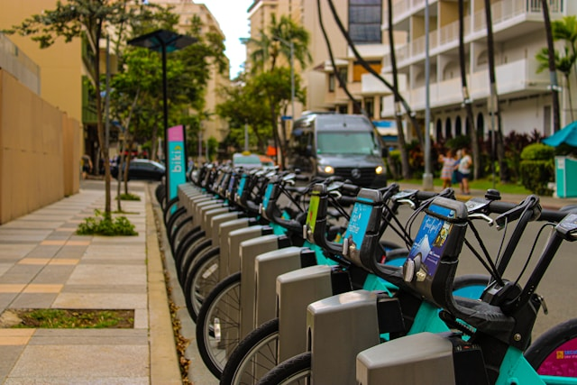
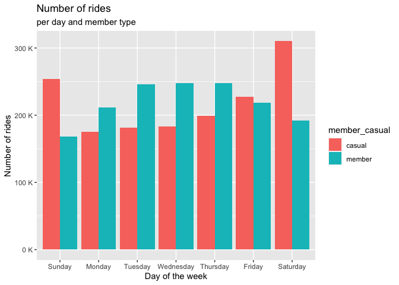
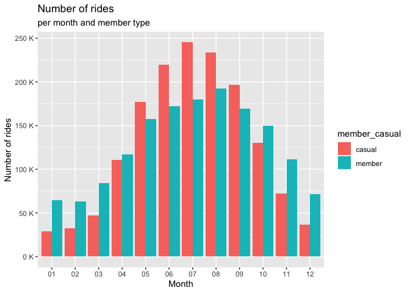
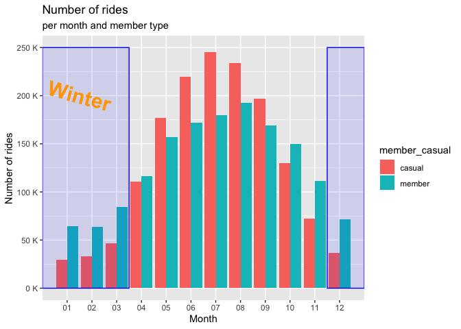
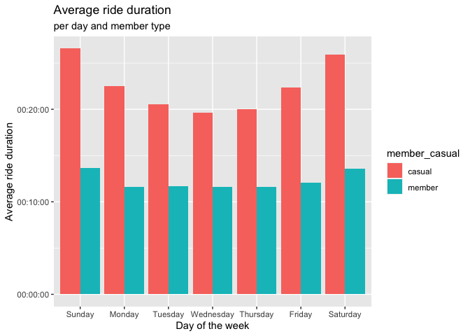
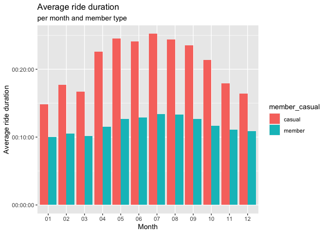
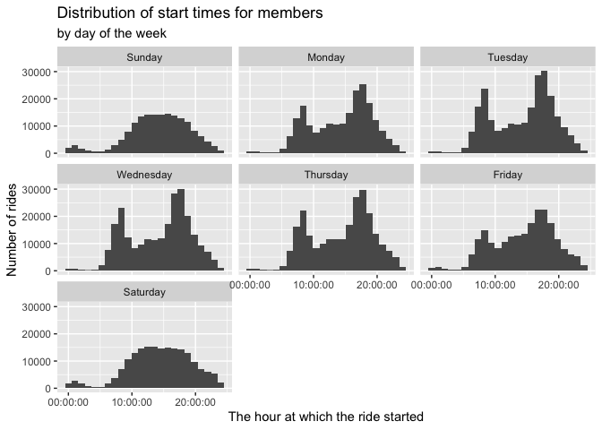
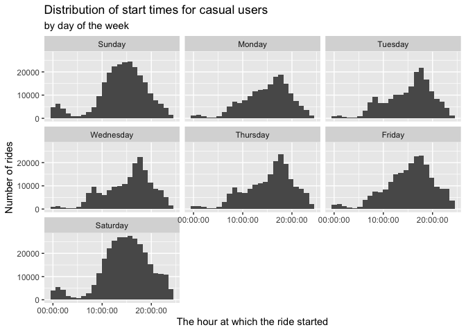

# Cyclistic data analysis

[Photograph by Kanoa Leong](https://unsplash.com/photos/a-row-of-bikes-parked-next-to-each-other-on-a-sidewalk-xbwmGakJuME)

## Introduction

In 2016, Cyclistic (a fictitious company) launched a successful bike-sharing offering. Since then, the program has grown to a fleet of 5,824 bikes georeferenced and locked to a network of 692 stations throughout Chicago. Bikes can be unlocked from one station and returned to any other station in the system at any time.

One of the approaches that helped make this possible was the flexibility of their pricing plans: single-ride passes, full-day passes, and annual memberships. Customers who purchase single-ride passes or full-day passes are called casual riders. Customers who purchase annual memberships are called Cyclistic members.

Cyclistic's financial analysts concluded that annual members are much more profitable than casual cyclists. The goal is clear: Design marketing strategies aimed at converting occasional cyclists into annual members. However, to do that, the marketing analyst team needs to better understand how annual members and casual riders differ, why casual riders would purchase a membership, and how digital media could impact their marketing tactics.

In this project, we show an interest in analyzing Cyclistic's historical bike trip data to identify trends that shed light to the answer to the following question: **How are annual members and casual riders different when it comes to using Cyclistic bikes?**

## The business task

Find any differences that may exist between casual cyclists and Cyclistic members based on Cyclistic trip data from the last 12 months.

## Preparing the data

This project uses data from a real company. The details about this dataset are shown in the following section. Next, we provide a summary of the cleaning steps and the link to access the complete files where the steps are more detailed.

### The Dataset

For this project, we used data provided by [Motivate](https://divvy-tripdata.s3.amazonaws.com/index.html) under this [license](https://divvybikes.com/data-license-agreement). We downloaded the files corresponding to the year 2023 (12 files).

This dataset contains information about the rides from the mentioned date. For each ride identified with a unique id, we have information about the type of bicycle used, start and end date including time, information about the start and end station like name, id, and location coordinates (longitude and latitude). There is also an attribute for the type of user, whether it is casual or member. This attribute is key to help us solving our business task.

### How data is stored?

To store the data, we created a folder containing the 12 individual files (one per month). Then we extracted each csv file and removed the original zip files. After verifying that each file has the same structure, we joined them into a single csv file. This is the file that we used for the following steps.

For a detailed view of the steps made, you can see the rmd notebook of the preparing process [here](https://github.com/OscarFernandezMX/Data_Science_Projects/blob/main/Cyclistic_preparing.Rmd).

## Data cleaning

The data was cleaned in two parts. One using PySpark and SQL, and then using R. Next, we describe briefly the steps followed to clean the data.

### Summary of cleaning steps

In part 1, we checked each attribute for inconsistencies like:  
- NULL or NA values.  
- Format of each attribute.  
- Range of numeric values.  
- Length of strings.  
- Unique values for categorical attributes.  

Based on these steps, we made the following changes in the data:  
- We found that there were rides whose date was before or after 2023. Although the information could be right, these didn't belong to our range of interest. Therefore, we removed the rides whose start or end date wasn't within that range.  
- We also found that there were incoherent dates where the start date was greater than the end date. The rows containing this inconsistency were also removed.  
- Finally, we removed rows with empty values for any attribute.

The complete report of the cleaning steps for part 1 can be found [here](https://github.com/OscarFernandezMX/Data_Science_Projects/blob/main/Cyclistic_cleaning_part1.ipynb).

In part 2, we added the following two attributes:  
- `ride_length`: a calculation of the duration of the ride based on the start and end dates.  
- `day_of_week`: calculated with the start day.  

After that, we noticed that there were more rides from members than from casual users. For this reason, we decided to downsample the members class to have balanced classes.

The complete report of the cleaning steps for part 2 can be found [here](https://github.com/OscarFernandezMX/Data_Science_Projects/blob/main/Cyclistic_cleaning_part2.md).

## Results

Before conducting the analysis, we decided to extract the components of the date to be able to analyze the data based on the month too. Therefore, we added the attributes `day`, `month` and `year` to our dataset After that, we decided to ignore the attributes related to the stations' location (latitude and longitude). With this final data, we made the analysis. Our results show the mean values by day of the week and by month for the number of rides and the average duration for each type of user.

The first difference that we can see between casual users and members is in the number of rides along the days of the week.

We can see that casual users tend to ride more than members on weekends. Member users ride more during the weekdays, and the numbers are very similar each workday. On weekends, specially Saturday and Sunday, they ride there are less rides than usual. How does this trend look like each month?

We can see that there is a considerable increase in the use of the bicycle starting from March and peaking in August. In September, the use starts to decrease and by December it is very low, specially in the causal riders. In these months, the member riders use the bicycle more than casual members. Casual users ride more than members from May to September. Maybe weather plays a role in this. Riding in cold temperatures is not very enjoyable for riders. It is not surprise that Winter might influence the number of rides as we can see in the next graph.

It is evident that during Winter, both casual and member users ride less. Now let's see the differences with the average ride duration for every day of the week.

The average duration of casual users' rides is almost twice than the average from member rides. In both cases, rides tend to last longer during the weekend, but this trend is more visible on casual members. Let's see what happened each month.

We can notably see that casual users ride more time than members each month. People tend to ride more time from April, peaking in July, then decreasing smoothly. Until November, the time average time for casual riders is still higher than 20 minutes. However, this trend is more smooth for members, where the average ride duration is almost the same, no matter the month.

At this point, we suspect that casual users ride as a recreational activity, while members use it also to commute to work. To investigate this further, we decided to graph the distribution of the start time of every ride.

In this plot we have some evidence that could suggest that members indeed use the bicycle to commute to work. Since we can see some peaks before 9:00 and after 15:00 h, which is within the workday. Interestingly, on weekends we can't see that trend, because most people work from Monday to Friday. What happens with casual users?

In the case of casual users, we can also see two main peaks, but the highest is after 15:00 h. While this might also suggest that causal riders commute on the bike to work, the available data is not enough to support more assumptions. The only thing we might suspect is that, since casual users ride more time, they might ride after work, not precisely to commute to their homes, but as a recreational ride.

## Conclusions

Based on the available data, we can notice two important differences between casual and member users:  
- It is probable that casual riders use the bicycle more for recreational uses. This explains why they ride more time, and the seasonal use.  
- Probably, people with membership use the bicycle to commute to work. This might explain why their rides last less and keep almost the same during the weekdays, and in every month. Though in winter they tend to ride less frequently, those who ride, still use the bicycle to commute, therefore, they take almost the same time to arrive, which might explain why the average time remains almost the same every month.

## Recomendations

Our recommendations based on this analysis are the following:  
1. Focus on showing the casual users that cycling can be more than a recreational rides. Specially, showing them the usefulness of the bicycle to commute.  
2. Showing the users the benefits of having access to bicycles all day, since they tend to ride more at a specific time of the day (probably paying a single ride). This might be in the form of how much they could save with the membership.  
3. Offer incentives for frequent casual users to get a discount in their first yearly membership. Casual users ride on average more time than members, they might be interested in knowing that they can enjoy more the benefits of a membership if they get a discount for the first year. For example, unlocking a discount for the membership after a certain minutes of riding.
